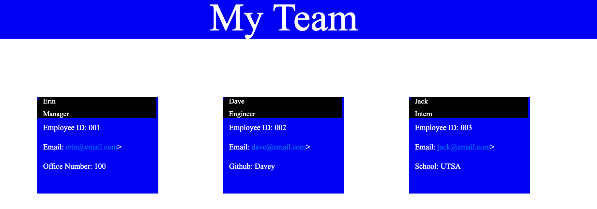

# Team-Generator

As a manager I want to generate a webpage that displays my team's basic info so that I have quick access to emails and GitHub profiles. 

The application I have developed uses html, css, and javascript. 

The user is able to run the application and is prompted to provide answers to begin building a team. 

The responses create individual cards for each employee apart of the team with key indentifiers based on their role. 

The manager is able to add as many team members as he/she chooses. 

